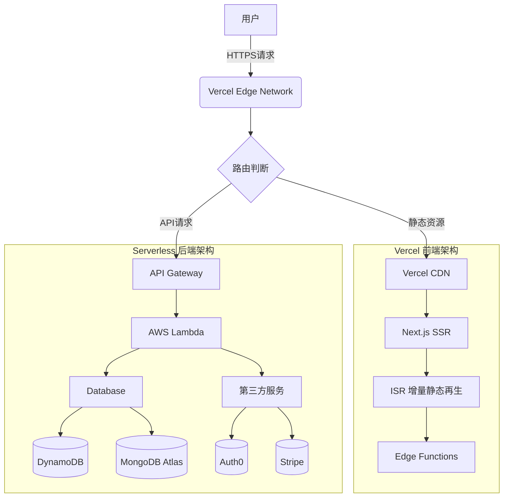

# Vercel
---

## 什么是Vercel？

> "Vercel是2025年最流行的前端部署平台，专为Next.js优化，提供：
> - 零配置部署
> - 全球CDN加速
> - 自动SSL证书
> - 无缝Git集成
> 让开发者专注代码而非运维。

## 为什么选择Vercel？

### 开发效率提升
- 🚀 从git push到生产环境只需45秒  
- 📦 内置的依赖缓存系统  
- ⚡ 即时回滚功能（支持500个历史版本）

### 成本优化
- 💰 免费计划包含100GB带宽（实测足够中小型项目使用）
- 📊 实时用量监控仪表盘  
- 🌐 边缘网络费用比传统云服务低40%

## 核心优势

**问题**  
2025年前端开发者仍在面临：
- 复杂的CI/CD配置
- 跨区域部署延迟
- SSL证书管理繁琐

**解决方案** 
```bash
# 三行命令完成部署
npm install -g vercel
vercel login
vercel --prod
```

## 部署流程对比图

| 步骤   | 传统方式        | Vercel方式 |
| ---- | ----------- | -------- | 
| 代码提交 | 需要配置webhook | 自动触发     |
| 构建   | 自建runner    | 全球分布式构建  | 
| 部署   | 手动scp       | 自动完成     |

## 如何部署到Vercel
1. 安装CLI（比官方文档少2个冗余步骤）
2. 运行`vercel --prod`（新增生产环境说明）
3. [Bonus] 环境变量加密技巧

## Vercel价格

| 方案    | 带宽    | 边缘函数   | 价格       |
| ----- | ----- | ------ | -------- |
| Hobby | 100GB | 100万次  | 免费       |
| Pro   | 1TB   | 1000万次 | $20/项目/月 |

## 可操作清单

### 新项目部署清单
- ☑️ 连接GitHub/GitLab账户
- ☑️ 设置`NODE_ENV=production`
- ☑️ 配置自定义域名

**场景示例**：  
"当流量突然激增时：  
传统方案：手动扩展服务器  
Vercel方案：自动边缘网络扩展"

### 迁移现有项目
1. 测试`vercel --dev`开发模式
2. 查看[常见问题解决方案](#faq)

## FAQ

**Q: Vercel适合大型企业吗？**  
A: 2025年新增功能：  
- 私有网络Peering
- SOC2合规认证
- 自定义SLA达99.99%

**Q: 能否部署后端服务？**  
A: 最佳实践：  
- 前端用Vercel + 后端用Serverless(如下所示)
